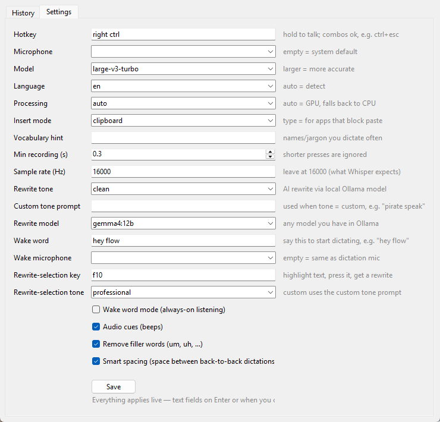
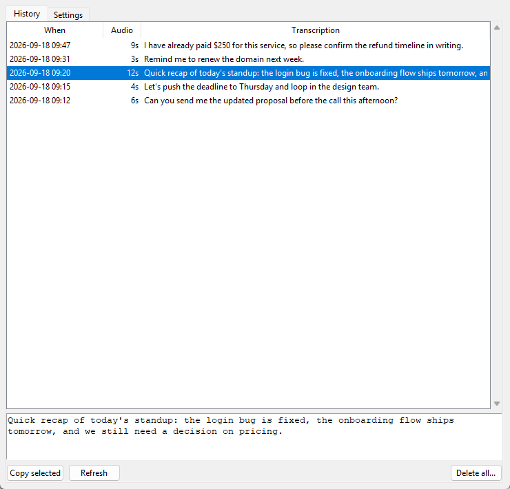

<p align="center"></p>

# FlowLocal

### ⬇️ [Download FlowLocal-win64.zip](https://github.com/Automated-Intelligence/flowlocal/releases/latest) — no install, no Python needed

**Free, offline voice dictation for Windows.** Hold a key, talk, release — the
text appears wherever your cursor is. A local replacement for subscription
dictation apps like Wispr Flow: speech recognition runs on your own machine
via [faster-whisper](https://github.com/SYSTRAN/faster-whisper), nothing is
sent to the cloud, and there's nothing to pay for.

## Features

- **Hold-to-talk dictation** into any app (default: hold Right Ctrl)
- **Wake word mode** — say "hey flow", speak, done (Siri-style, always-on)
- **Rewrite anything** — highlight text, press F10, and it's rewritten in a
  professional tone (or friendly / concise / your own instruction)
- **AI cleanup of dictation** — false starts and self-corrections fixed
  ("Tuesday, no wait, Wednesday" → "Wednesday"), filler words removed
- **Smart spacing** between back-to-back dictations
- **History window** with every transcription, click to copy
- **Settings window** — everything applies live, no restarts
- GPU accelerated on NVIDIA cards; automatic CPU fallback everywhere else

The AI rewrite features use a local model through [Ollama](https://ollama.com)
(also free and offline). Without Ollama installed, FlowLocal simply pastes the
raw transcription — everything else works.

## Screenshots

| Settings — everything applies live | History — every dictation, click to copy |
| --- | --- |
|  |  |

## Two kinds of AI rewriting

Both run on your own GPU through Ollama, and both can be set to any tone:
**professional**, **clean**, **friendly**, **concise**, or **custom** (your own
instruction, e.g. "rewrite as a short polite text message").

### 1. Rewrite tone — polishes everything you dictate

Applied automatically to each dictation before it's typed. Speech is messy;
this makes it read like you typed it.

| Tone | You said | You get |
| --- | --- | --- |
| **clean** (default) | "so basically send the report on Tuesday no wait Wednesday because Tuesday I have that meeting with the the contractor guy" | "So basically send the report on Wednesday because Tuesday I have that meeting with the contractor guy." |
| **professional** | *same* | "We should send the report on Wednesday instead of Tuesday, as I have a meeting with the contractor on Tuesday." |
| **concise** | *same* | "Send the report Wednesday; I have a contractor meeting Tuesday." |
| **off** | *same* | the raw transcription, filler words removed |

`clean` keeps your own words and only fixes grammar, false starts, and
self-corrections. `professional` rewrites the wording. Setting: **Rewrite
tone** in Settings (`rewrite_tone`).

### 2. Rewrite-selection tone — fix text that's already written

Highlight any text in any app — an email draft, a chat message, a document —
press **F10**, and it's replaced in place with a rewrite. No dictation
involved; it works on anything you or someone else typed.

> **Before:** "hey the guy never showed, kinda annoying, we already paid 250 bucks for this"
> **After (professional):** "The individual did not attend as scheduled. This is concerning, as we have already paid $250 for this service."

The key and tone are independent of dictation: **Rewrite-selection key** and
**Rewrite-selection tone** in Settings (`rewrite_selection_hotkey`,
`rewrite_selection_tone`). Your clipboard is restored afterwards.

## Download (no Python needed)

1. Grab `FlowLocal-win64.zip` from the
   [latest release](../../releases/latest) and unzip it anywhere.
2. Run `FlowLocal.exe`. Windows SmartScreen will warn once because the app
   isn't code-signed — click **More info → Run anyway**.
3. The first launch downloads the speech model (~1.6 GB, one time). After
   that it's fully offline.
4. A tray icon appears: grey = loading, blue = ready. **Hold Right Ctrl**,
   speak, release.
5. Double-click the tray icon for Settings & History.

For AI rewriting, install [Ollama](https://ollama.com), then in a terminal:
`ollama pull gemma4:12b` (needs ~8 GB of VRAM; use `qwen2.5:7b` or smaller on
lighter GPUs). FlowLocal starts Ollama itself when needed.

## System requirements

| | |
| --- | --- |
| OS | Windows 10/11, 64-bit (Windows-only: uses winsound, Windows key hooks, SendInput) |
| GPU | Optional. NVIDIA with ~2 GB free VRAM for `large-v3-turbo`; CPU fallback otherwise (pick `small.en` or `distil-large-v3` in Settings for snappy CPU transcription) |
| RAM | ~2 GB free |
| Disk | ~2 GB for the app, ~2 GB for speech models, plus your Ollama model if used |
| Mic | Any input device |
| Internet | One-time model downloads only |

## Running from source

Requires Python 3.9–3.12 (3.11 recommended).

```
git clone <this repo>
cd flowlocal
py -3.11 -m venv venv
venv\Scripts\pip install -r requirements.txt
FlowLocal.bat
```

`FlowLocal.bat` runs the app under `supervisor.py`, a watchdog that restarts
it if it ever dies. To also start at login and self-heal every 10 minutes:
`powershell -ExecutionPolicy Bypass -File install_autostart.ps1`
(add `-Remove` to undo).

To rebuild the standalone bundle: `venv\Scripts\pip install pyinstaller` then
`venv\Scripts\pyinstaller FlowLocal.spec --noconfirm` → `dist\FlowLocal\`.

## Configuration

Everything below is editable in the Settings window (tray icon → double-click)
and stored in `config.json` next to the app.

| Key | Default | Notes |
| --- | --- | --- |
| `hotkey` | `right ctrl` | Hold to talk. Any name the `keyboard` library accepts (`f9`, `caps lock`, `ctrl+esc`…). Combos are suppressed so the OS doesn't also act on them. |
| `model` | `large-v3-turbo` | Whisper model. `distil-large-v3` (English-only, faster), `medium`, `small.en`… |
| `device` | `auto` | `auto` tries GPU then CPU; force with `cuda` / `cpu`. |
| `language` | `en` | `auto` to detect, or any ISO code. |
| `input_device` | `""` | Microphone name substring. Empty = system default. |
| `paste_mode` | `clipboard` | `clipboard` pastes via Ctrl+V; `type` injects keystrokes for apps that block paste. |
| `remove_fillers` | `true` | Strips um/uh/hmm-style fillers. |
| `smart_spacing` | `true` | Leading space when you dictate again without typing/clicking in between. |
| `initial_prompt` | `""` | Vocabulary hint — names/jargon you use often. |
| `wake_word_enabled` | `false` | Always-on listening for the wake word (a tiny CPU model listens; the GPU stays free). |
| `wake_word` | `hey flow` | The phrase. Two words with a distinctive first word work best. |
| `wake_input_device` | `""` | Mic for wake mode. Empty = same as dictation mic. |
| `wake_silence_seconds` | `1.2` | Silence that ends a wake-word dictation. |
| `rewrite_tone` | `off` | AI cleanup of dictation via Ollama: `off`, `clean`, `professional`, `friendly`, `concise`, `custom`. |
| `rewrite_selection_hotkey` | `f10` | Highlight text, press it, get a rewrite pasted over the selection. |
| `rewrite_selection_tone` | `professional` | Tone for selection rewrites. |
| `rewrite_custom_prompt` | `""` | Your own instruction, used when a tone is `custom`. |
| `rewrite_model` | `qwen2.5:7b` | Any model in your local Ollama. |
| `ollama_url` | `http://localhost:11434` | |
| `audio_cues` | `true` | Beeps on record start / stop / done / error. |
| `min_recording_seconds` | `0.3` | Shorter presses are ignored. |

### Rewrite safety

Every AI rewrite is checked before it reaches your cursor: it's rejected if it
introduces numbers, dates or days that weren't in the original, if the model
answered instead of rewriting, or if the length is suspicious. A rejected
rewrite means you get the raw transcription (or, for a highlighted selection,
an error beep and your text untouched) — never a hallucination. Both the raw
and rewritten versions are kept in History.

## How it works

Two source files, ~1,500 lines of Python: `flowlocal.py` (audio capture,
Whisper transcription, rewrite guards, hotkeys, wake word, tray icon) and
`ui.py` (tkinter settings/history window). `supervisor.py` is the watchdog.
Key libraries: `faster-whisper` / CTranslate2, `sounddevice`, `keyboard`,
`mouse`, `pystray`.

## Notes

- Speech models are cached in `%USERPROFILE%\.cache\huggingface`.
- If dictation doesn't type into an elevated (admin) window, run FlowLocal as
  admin too — Windows blocks input injection from normal to elevated processes.
- Logs: `flowlocal.log` (and `crash.log` for native faults) next to the app.
- Mac/Linux would need a port: the beeps, the paste keystroke, and the
  `keyboard` hook backend are Windows-specific.

## License

MIT — see `LICENSE`.
